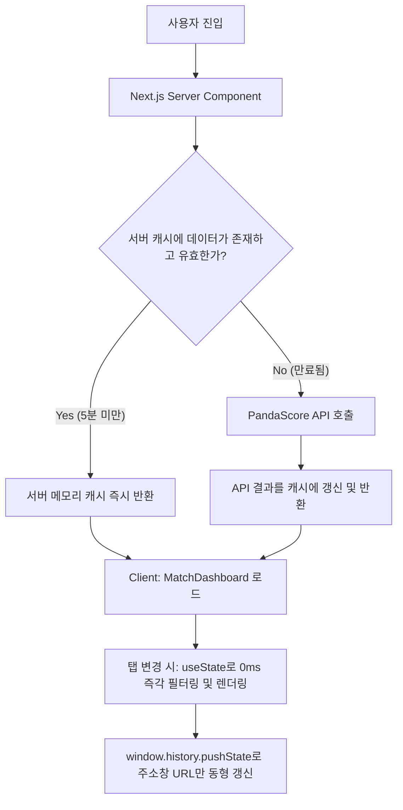

# 🏆 LCK 2026 Match Tracker

<div align="center">


[](https://lol-league.vercel.app/)

### [🚀 실시간 데모 사이트 방문하기 (Live Demo)](https://lol-league.vercel.app/)

PandaScore LoL API를 직연동하고 Next.js 15+ 서버 메모리 캐싱을 접목하여 설계한 **초경량 LCK 경기 일정 & 스코어 트래커**입니다.  
기존의 무거운 데이터베이스(Supabase) 레이어를 전면 제거하고 API 다이렉트 쿼리와 클라이언트 사이드 리액트 상태 제어를 융합하여, 배포 환경에서도 **딜레이 없는 0ms 탭 전환 속도**와 **완벽한 API 호출 한도 방어**를 달성했습니다.

</div>

---

## ⚡ Key Features (핵심 차별점)

### 1. 0ms 즉각적인 탭 전환 (Client-side Orchestration)
* 월(Month) 탭 및 리그 탭 클릭 시 서버 왕복 네트워크 요청(RSC payload fetch)이 전혀 발생하지 않습니다.
* 브라우저 메모리에 이미 로드된 경기 데이터를 리액트 내부 상태(`useState`)로 즉시 필터링하여 0.001초 만에 화면을 갱신하므로 배포 환경에서도 렉이 100% 제거됩니다.
* `window.history.pushState`를 이용하여 페이지 리로드 및 서버 요청 없이 주소창 URL만 동기화하므로, 새로고침이나 공유 시에도 필터 상태가 그대로 유지됩니다.

### 2. Next.js 15+ 서버 메모리 캐싱 (`use cache`)
* PandaScore API 호출 결과를 Next.js 서버 메모리 레이어에 **5분간 강제 캐시(Stale-while-revalidate)**하여 사용자가 아무리 많아도 분당 API 호출 횟수(Rate Limit)를 철저히 보관 및 절약합니다.
* `lib/actions/match.ts` 내에 `use cache` 지시어 및 `cacheLife` 설정을 적용하여 구현되었습니다.

### 3. 정밀 감속 스무스 스크롤 유틸 (`smoothScrollTo`)
* 브라우저 내장 스크롤의 버그와 렉을 회피하기 위해, `requestAnimationFrame`과 `easeOutCubic` 가속 보정 공식을 이용해 직접 제작한 커스텀 스크롤 유틸을 탑재했습니다.
* 최초 홈 진입 시 오늘 날짜(또는 가장 가까운 일정)가 있는 곳으로 부드럽고 묵직하게 자동 포커싱 다운됩니다.
* 최초 진입 이후 탭을 바꿀 때는 스크롤이 고정되어 사용자 경험(UX)을 방해하지 않습니다.

### 4. LCK 팀명 한글화 매핑 및 스키마 어댑터
* PandaScore API에서 넘어오는 길고 복잡한 영어 팀명들을 직관적이고 친숙한 LCK 한글 팀명(한화생명, 농심 레드포스, 한진 브리온, 키움 DRX 등)으로 어댑팅 단계에서 자동 번역하여 레이아웃 가독성을 극대화했습니다.
* 복잡하고 중첩된 PandaScore의 API 응답 데이터 타입을 기존 UI 규격에 맞게 1:1로 가공해주는 전용 어댑터(`lib/utils/adapter.ts`)를 설계했습니다.

---

## 📐 Data Flow Architecture (데이터 흐름)



---

## 📁 Project Structure (프로젝트 구조)

```bash
lol-league/
├── app/                  # Next.js App Router (Page, Layout, Globals)
│   ├── page.tsx          # 서버 컴포넌트: PandaScore 데이터 Fetcher 및 대시보드 로드
│   ├── layout.tsx        # 글로벌 레이아웃 (Theme Provider 적용)
│   └── globals.css       # 글로벌 Tailwind 스타일 지정
├── components/           # UI 컴포넌트 폴더
│   ├── common/           # 공용 UI (Header, ThemeToggle, Icons, 등)
│   └── match/            # 매치 트래커 핵심 UI
│       ├── LeagueTabs.tsx       # 리그 필터링 탭
│       ├── MonthTabs.tsx        # 월별 네비게이션 탭
│       ├── MatchDashboard.tsx   # 상태 제어 및 0ms 탭 전환 오케스트레이션
│       ├── MatchList.tsx        # 매치 리스트 렌더러 및 스무스 스크롤 작동
│       └── MatchCard.tsx        # 매치 카드 세부 정보 및 스코어 보드
├── lib/                  # 비즈니스 로직 및 유틸리티
│   ├── actions/          # Next.js Server Actions (use cache 적용 API 호출)
│   │   └── match.ts      # PandaScore 연동 및 캐싱 처리
│   └── utils/            # 유틸리티 함수
│       ├── adapter.ts    # PandaScore API 데이터 -> 로컬 인터페이스 변환 (한글 치환 포함)
│       ├── scroll.ts     # requestAnimationFrame & easeOutCubic 기반 스무스 스크롤
│       ├── date.ts       # KST 기준 날짜 포맷팅 및 파싱 헬퍼
│       └── match.ts      # 매치 데이터 클라이언트 사이드 필터링 로직
├── types/                # TypeScript 타입 정의 파일
│   ├── match.ts          # 프론트엔드 UI용 도메인 모델 정의
│   └── pandascore.ts     # PandaScore API 스키마에 준하는 전용 타입 정의
├── .env.local            # API Key 등 로컬 환경 변수
└── README.md             # 프로젝트 가이드라인
```

---

## 🛠️ Technology Stack (기술 스택)

* **Framework**: Next.js 15.2.7 (App Router)
* **Library**: React 19.2.4
* **Language**: TypeScript 5
* **Styling**: Tailwind CSS 4.0
* **API Source**: PandaScore LoL REST API (LCK Series ID: 10419)
* **Deployment**: Vercel

---

## 🚀 Getting Started (시작하기)

### 1. 환경 변수 설정
프로젝트 루트 디렉토리에 `.env.local` 파일을 생성하고 아래와 같이 PandaScore API 토큰을 설정합니다.

```env
# .env.local
PANDASCORE_API_TOKEN=your_pandascore_token_here
```

### 2. 패키지 설치
의존성 패키지를 설치합니다.

```bash
npm install
```

### 3. 로컬 개발 서버 실행
로컬 개발 서버를 기동합니다.

```bash
npm run dev
```

브라우저에서 `http://localhost:3000`에 접속하여 결과를 확인합니다. 
주소창에 `?month=6` 혹은 `?league=LCK` 등을 붙여서 접속했을 때, 해당 필터가 초기 적용된 상태에서 스무스 스크롤이 지정 위치로 동작하는지 확인 가능합니다.

---

## 💡 Code Highlights (핵심 코드 설명)

### 1. 5분 단위의 서버 사이드 메모리 캐싱
Next.js 15+의 `use cache`와 `cacheLife`를 통해, Rate Limit 제약이 타이트한 무료 API 요금제 환경에서도 안전하게 구동되도록 설계되었습니다.
```typescript
// lib/actions/match.ts
export const getMatches = async (): Promise<Match[]> => {
  "use cache";
  cacheLife({
    stale: 300,  // 5분 동안 최신 데이터로 보장
    expire: 600, // 최대 10분 후 무조건 재생성
  });

  const res = await fetch(`https://api.pandascore.co/lol/matches?filter[serie_id]=10419&token=${token}...`);
  const rawMatches = await res.json();
  return rawMatches.map(adaptPandaScoreMatch);
};
```

### 2. pushState를 통한 URL 비동기식 브라우저 동기화
사용자가 탭을 바꿀 때, 서버로 RSC 패킷을 재요청하는 Next.js `<Link>` 방식을 쓰지 않고 상태 변경과 동시에 주소창만 부드럽게 동기화합니다.
```typescript
// components/match/MatchDashboard.tsx
const syncUrlParams = (month: number, league: string) => {
  const params = new URLSearchParams();
  params.set("month", month.toString());
  if (league !== "all") {
    params.set("league", league);
  }
  const newUrl = `${window.location.pathname}?${params.toString()}`;
  window.history.pushState({ ...window.history.state, as: newUrl, url: newUrl }, "", newUrl);
};
```

### 3. easeOutCubic 커스텀 스무스 스크롤
브라우저 기본 `scrollIntoView`가 동반하는 스크롤 정지 및 떨림 현상을 해소하고 부드러운 감속 가속(Easing) 효과를 지원합니다.
```typescript
// lib/utils/scroll.ts
const easeOutCubic = (t: number): number => 1 - (1 - t) ** 3;

export const smoothScrollTo = (element: HTMLElement, duration = 500, offset = 0): void => {
  const root = document.scrollingElement ?? document.documentElement;
  const startTop = root.scrollTop;
  const elementRect = element.getBoundingClientRect();
  const absoluteElementTop = startTop + elementRect.top;
  const targetTop = absoluteElementTop - window.innerHeight / 2 + element.clientHeight / 2 - offset;
  const distance = targetTop - startTop;

  if (Math.abs(distance) <= 1) return;

  const startTime = performance.now();
  const step = (currentTime: number) => {
    const elapsedTime = currentTime - startTime;
    const progress = Math.min(elapsedTime / duration, 1);
    const easedProgress = easeOutCubic(progress);

    root.scrollTop = startTop + distance * easedProgress;

    if (progress < 1) {
      window.requestAnimationFrame(step);
    }
  };
  window.requestAnimationFrame(step);
};
```
